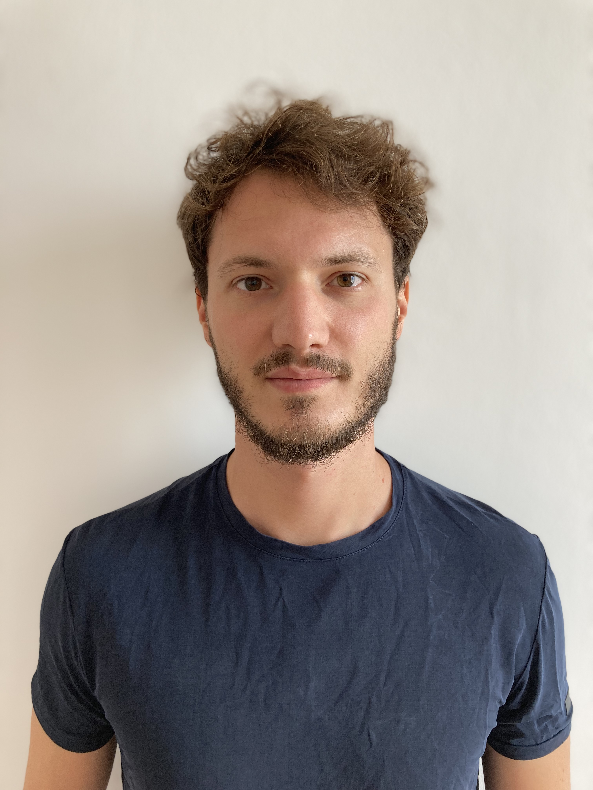

```{js, echo = FALSE}
document.title = "Home"
```

<div align="center">
# Federico Fabio Frattini 
<div>

****

<div id=content-desktop>

<div style="float:left; width:60%;" align="justify">

### Welcome to my website!

<br />

I am a Researcher at the <a href="https://www.feem.it/" target="_blank">Fondazione Eni Enrico Mattei</a>. I obtained a PhD in Economics at the <a href="https://www.tcd.ie/Economics/" target="_blank">Trinity College Dublin</a> under the supervision of Prof. <a href="https://nicolamastrorocco.com/" target="_blank">Nicola Mastrorocco</a> and of Prof <a href="https://marvinsuesse.com/" target="_blank">Marvin Suesse</a>. 

My research interests revolve around Political Economics, Labor Economics and Micro-econometrics. I am particularly focused on the political and labour markets effects of the green transition and on the political economy of crime. I am enthusiast about coding, using programming and statistical software such as STATA, Python and R. Beyond economics, I like sports, basketball and football in particular, travelling and videogames.

This is my <a href="cv_fff.pdf#" class="download" target="_blank" title="Download CV as PDF">**CV**</a>, while this is a detailed outline of my current <a href="https://fedfabfrat.github.io/research.html">**research projects**</a>, and this is a list of the <a href="https://fedfabfrat.github.io/teaching.html">**courses**</a> I taught.

<br />

**Contact information:**

* Email: [frattinf@tcd.ie](mailto:frattinf@tcd.ie); [federico.frattini@feem.it](mailto:federico.frattini@feem.it)

* Twitter: <a href="https://twitter.com/FedFabFrat" target="_blank">FedFabFrat</a>

</div>

<div style="float:right; width:40%; margin-left:20px; margin-right:-105px;">

{width=70%}

<br />


</div>

</div>


<div id=content-mobile>

 
## Welcome to my website!

<br />

I am a Researcher at the <a href="https://www.feem.it/" target="_blank">Fondazione Eni Enrico Mattei</a>. I obtained a PhD in Economics at the <a href="https://www.tcd.ie/Economics/" target="_blank">Trinity College Dublin</a> under the supervision of Prof. <a href="https://nicolamastrorocco.com/" target="_blank">Nicola Mastrorocco</a> and of Prof <a href="https://marvinsuesse.com/" target="_blank">Marvin Suesse</a>. 

My research interests revolve around Political Economics, Labor Economics and Micro-econometrics. I am particularly focused on the political and labour markets effects of the green transition and on the political economy of crime. I am enthusiast about coding, using programming and statistical software such as STATA, Python and R. Beyond economics, I like sports, basketball and football in particular, travelling and videogames.

This is my <a href="cv_fff.pdf#" class="download" target="_blank" title="Download CV as PDF">**CV**</a>, while this is a detailed outline of my current <a href="https://fedfabfrat.github.io/research.html">**research projects**</a>, and this is a list of the <a href="https://fedfabfrat.github.io/teaching.html">**courses**</a> I taught.

<br />

**Contact information:**

* Email: [frattinf@tcd.ie](mailto:frattinf@tcd.ie); [federico.frattini@feem.it](mailto:federico.frattini@feem.it)

* Twitter: <a href="https://twitter.com/FedFabFrat" target="_blank">FedFabFrat</a>

<br />

<br />

<div align="center">

{width=70%}

<br />


</div>

</div>
