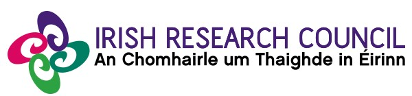

****

## Welcome to my website!

 

I am a PhD candidate at <a href="https://www.tcd.ie/Economics/" target="_blank">Trinity College Dublin</a>, where I am funded by the <a href="https://research.ie/" target="_blank">Irish Research Council</a>. Before joining TCD, I obtained a MSc in Economics from the <a href="https://international.unicatt.it/ucscinternational-economics" target="_blank">Università Cattolica del Sacro Cuore</a> in Milan, after which I joined for a short time <a href="https://www.sas.com/it_it/home.html" target="_blank">SAS</a> with the role of Training Analytical Consultant.

My research interests revolve around Political Economics, Economics of Crime and Microeconometrics. I am enthusiast about coding, STATA, Python and R in particular. I built this website using Rmarkdown and Github. Beyond economics, I like sports, basketball and football in particular, travelling and videogames.

This is my <a href="cv_ps.pdf#" class="download" target="_blank" title="Download CV as PDF">**CV**</a>, while this is a detailed outline of my current <a href="https://fedfabfrat.github.io/research.html">**research projects**</a>, and this is a brief list of the <a href="https://fedfabfrat.github.io/teaching.html">**courses**</a> I taught during my PhD experience.

 

**Contact information:**

* Email: [frattinf@tcd.ie](mailto:frattinf@tcd.ie)

* Twitter: <a href="https://twitter.com/FedFabFrat" target="_blank">FedFabFrat</a>

* Phone number: +353 (87) 2172669

{width=70%}

 

{width=70%}

 
## Welcome to my website!

 

I am a PhD candidate at <a href="https://www.tcd.ie/Economics/" target="_blank">Trinity College Dublin</a>, where I am funded by the <a href="https://research.ie/" target="_blank">Irish Research Council</a>. Before joining TCD, I obtained a MSc in Economics from the <a href="https://international.unicatt.it/ucscinternational-economics" target="_blank">Università Cattolica del Sacro Cuore</a> in Milan, after which I joined for a short time <a href="https://www.sas.com/it_it/home.html" target="_blank">SAS</a> with the role of Training Analytical Consultant.

My research interests revolve around Political Economics, Economics of Crime and Microeconometrics. I am enthusiast about coding, STATA, Python and R in particular. I built this website using Rmarkdown and Github. Beyond economics, I like sports, basketball and football in particular, travelling and videogames.

This is my <a href="cv_ps.pdf#" class="download" target="_blank" title="Download CV as PDF">**CV**</a>, while this is a detailed outline of my current <a href="https://fedfabfrat.github.io/research.html">**research projects**</a>, and this is a brief list of the <a href="https://fedfabfrat.github.io/teaching.html">**courses**</a> I taught during my PhD experience.

 

**Contact information:**

* Email: [frattinf@tcd.ie](mailto:frattinf@tcd.ie)

* Twitter: <a href="https://twitter.com/FedFabFrat" target="_blank">FedFabFrat</a>

* Phone number: +353 (87) 2172669

 

 

{width=70%}

 

{width=90%}

