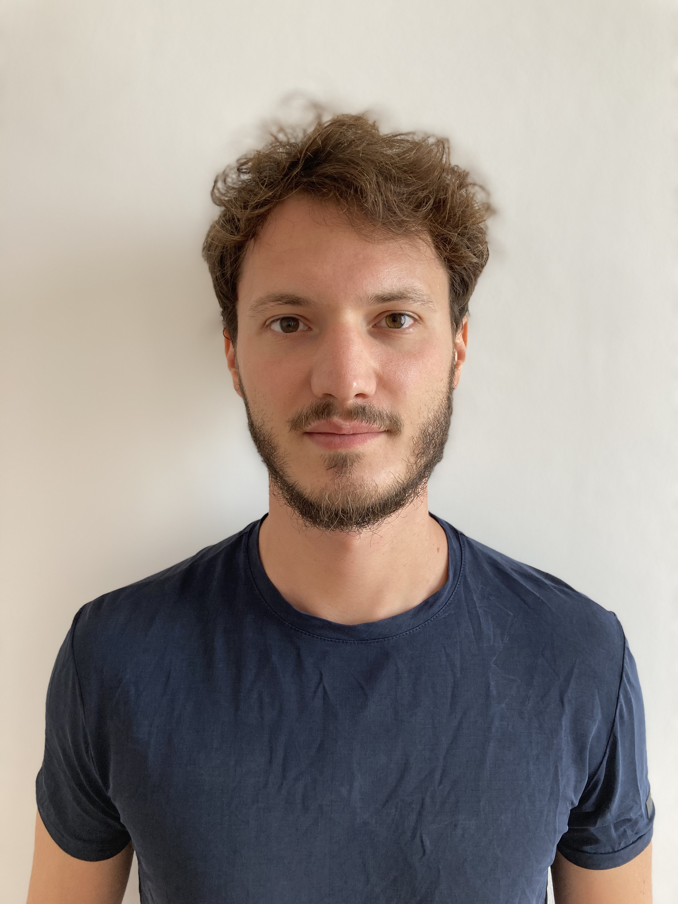

# Federico Fabio Frattini

****

I am a Researcher at <a href="https://www.feem.it/ricerca/programmi/labour-in-the-low-carbon-transition/" target="_blank">FEEM</a> and an Adjunct Professor at the DESP department at the <a href="https://www.unimi.it/it/ugov/person/federico-frattini" target="_blank">University of Milan</a>. I obtained a PhD in Economics at the <a href="https://www.tcd.ie/Economics/" target="_blank">Trinity College Dublin</a>.

Applied economist working on:

- Organised crime and human/civic capital
- Political competition, participation and identity-based rhetoric
- Green transition, labour markets, and regional development

This is my <a href="cv_fff.pdf#" class="download" target="_blank" title="Download CV as PDF">CV</a>, while this is a detailed outline of my current <a href="https://fedfabfrat.github.io/research.html">research projects</a>, and this is a list of the <a href="https://fedfabfrat.github.io/teaching.html">courses</a> I taught.

#### **News**: 
- **Eroding Civic Capital: How Persistent Organised Crime Diminishes Tax Compliance**,
*with* <a href="https://sites.google.com/view/francescacalamunci/home?authuser=0" target="_blank">*Francesca Maria Calamunci*</a>, published at ***The Journal of Law, Economics & Organization***

- **Concurrent Elections, Candidate Entry, and Local Competition**, conditionally accepted at ***Public Choice***

 

{width=70%}

 

**Contact information:**

* [frattinf@tcd.ie](mailto:frattinf@tcd.ie)

* [federico.frattini@feem.it](mailto:federico.frattini@feem.it)

<a href="https://scholar.google.com/citations?user=O52eMocAAAAJ&hl=it" target="_blank" aria-label="Google Scholar"><i class="bi bi-mortarboard-fill"></i></a>
<a href="https://github.com/FedFabFrat" target="_blank" aria-label="GitHub"><i class="bi bi-github"></i></a>
<a href="https://twitter.com/FedFabFrat" target="_blank" aria-label="Twitter"><i class="bi bi-twitter-x"></i></a>
<a href="https://www.linkedin.com/in/federico-fabio-frattini/" target="_blank" aria-label="LinkedIn"><i class="bi bi-linkedin"></i></a>

I am a Researcher at <a href="https://www.feem.it/ricerca/programmi/labour-in-the-low-carbon-transition/" target="_blank">FEEM</a> and an Adjunct Professor at the DESP department at the <a href="https://www.unimi.it/it/ugov/person/federico-frattini" target="_blank">University of Milan</a>. I obtained a PhD in Economics at the <a href="https://www.tcd.ie/Economics/" target="_blank">Trinity College Dublin</a>.

Applied economist working on:

- Organised crime and human/civic capital
- Political competition, participation and identity-based rhetoric
- Green transition, labour markets, and regional development

This is my <a href="cv_fff.pdf#" class="download" target="_blank" title="Download CV as PDF">CV</a>, while this is a detailed outline of my current <a href="https://fedfabfrat.github.io/research.html">research projects</a>, and this is a list of the <a href="https://fedfabfrat.github.io/teaching.html">courses</a> I taught.

#### **News**: 
- **Eroding Civic Capital: How Persistent Organised Crime Diminishes Tax Compliance**,
*with* <a href="https://sites.google.com/view/francescacalamunci/home?authuser=0" target="_blank">*Francesca Maria Calamunci*</a>, published at ***The Journal of Law, Economics & Organization***

- **Concurrent Elections, Candidate Entry, and Local Competition**, conditionally accepted at ***Public Choice***

 

{width=70%}

 

**Contact information:**

* [frattinf@tcd.ie](mailto:frattinf@tcd.ie)

* [federico.frattini@feem.it](mailto:federico.frattini@feem.it)

<a href="https://scholar.google.com/citations?user=O52eMocAAAAJ&hl=it" target="_blank" aria-label="Google Scholar"><i class="bi bi-mortarboard-fill"></i></a>
<a href="https://github.com/FedFabFrat" target="_blank" aria-label="GitHub"><i class="bi bi-github"></i></a>
<a href="https://twitter.com/FedFabFrat" target="_blank" aria-label="Twitter"><i class="bi bi-twitter-x"></i></a>
<a href="https://www.linkedin.com/in/federico-fabio-frattini/" target="_blank" aria-label="LinkedIn"><i class="bi bi-linkedin"></i></a>

